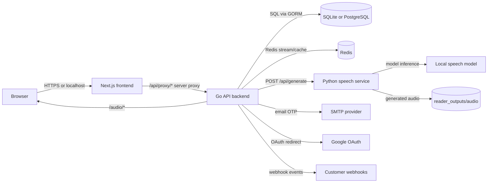

# Architecture

Khmer TTS Narration Studio is split into four runtime services: the Next.js frontend, the Go public API, the Python speech service, and Redis. The Go API is the public backend boundary. The Python service is treated as internal model infrastructure.

## Runtime Diagram



## Request Flow

1. The browser loads the frontend at `http://localhost:3000`.
2. Frontend API calls go through Next.js route handlers under `/api/proxy/*`.
3. Next.js forwards requests to the Go backend at `http://localhost:8080`.
4. The Go backend authenticates users with cookies, JWTs, or API keys.
5. Speech generation requests create `generation_jobs` rows.
6. The queue worker splits text into `generation_chunks`.
7. Each chunk is sent to the Python service at `POST /api/generate`.
8. Chunk audio is saved, merged, and exposed through `/audio/<job_id>/final.wav`.
9. Credits are deducted only after the job completes.
10. Notifications and webhooks are emitted for completed or failed jobs.

## Service Responsibilities

| Service | Port | Responsibility |
|---|---:|---|
| Next.js frontend | `3000` | User dashboard, admin dashboard, docs UI, auth screens, API proxy routes |
| Go backend | `8080` | Auth, users, sessions, plans, credits, API keys, admin tools, queues, webhooks, audio file serving |
| Python speech service | `8810` | Model loading, speech generation, voice previews, local Gradio UI, legacy direct API |
| Redis | `6379` | Queue stream, optional cache, progress tracking, fallback to memory if unavailable |
| SQLite/PostgreSQL | configurable | Persistent users, jobs, plans, API keys, identity checks, audit logs, notifications |

## Local Development Modes

### Full Local

Run Python, Go, Redis, and Next.js directly on the host. This is best for active development because logs and hot reloads are easy to inspect.

```bash
./scripts/setup-mac.sh
./scripts/restart_narration_studio.sh
```

Windows:

```powershell
.\scripts\setup-windows.ps1
.\scripts\run-local-windows.ps1
```

### Docker

Run all services through Compose:

```bash
docker compose up --build
```

This starts Redis, the Python service, the Go backend, and the Next.js frontend.

## Storage Layout

| Path | Purpose |
|---|---|
| `reader_outputs/audio` | Generated job audio, identity uploads, final WAV/MP3 files |
| `go-backend/reader_outputs` | Local backend SQLite output when running from `go-backend` |
| `voice_clone_dataset` | Bundled and uploaded voice reference files |
| `models` | Local model files and model profile metadata |
| `conf` | Fine-tuning and local model configuration |

## Production Notes

- Put the Go backend behind HTTPS.
- Keep the Python speech service private on an internal network.
- Use PostgreSQL for persistent production data.
- Use Redis for queue durability and progress tracking.
- Replace `JWT_SECRET`, SMTP, OAuth, and admin bootstrap values before deployment.
- Store generated audio on persistent disk or object storage if the service is scaled horizontally.
