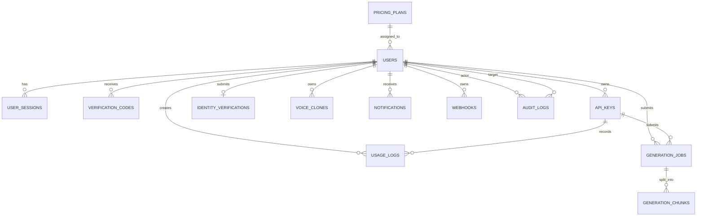

# Database

The Go backend owns the main application database. It uses GORM and can run on SQLite or PostgreSQL.

## Local SQLite

Default local settings:

```env
DATABASE_DRIVER=sqlite
DATABASE_DSN=reader_outputs/auth.db
```

The backend creates the directory and runs GORM auto-migrations on startup.

## PostgreSQL

Use PostgreSQL for production or shared team environments.

Example `go-backend/.env`:

```env
DATABASE_DRIVER=postgres
DATABASE_DSN=host=localhost user=nstudio password=nstudio dbname=nstudio port=5432 sslmode=disable TimeZone=UTC
```

Local Postgres with Docker:

```bash
docker run --name khmer-tts-postgres \
  -e POSTGRES_USER=nstudio \
  -e POSTGRES_PASSWORD=nstudio \
  -e POSTGRES_DB=nstudio \
  -p 5432:5432 \
  -d postgres:16
```

Then start the Go backend:

```bash
cd go-backend
DATABASE_DRIVER=postgres \
DATABASE_DSN="host=localhost user=nstudio password=nstudio dbname=nstudio port=5432 sslmode=disable TimeZone=UTC" \
go run ./cmd/server
```

## Migrations

Current runtime migrations are handled by GORM `AutoMigrate` in `go-backend/internal/database/database.go`. The auto-migrated tables are:

- `pricing_plans`
- `users`
- `user_sessions`
- `verification_codes`
- `api_keys`
- `usage_logs`
- `generation_jobs`
- `generation_chunks`
- `identity_verifications`
- `voice_clones`
- `notifications`
- `webhooks`
- `audit_logs`
- `app_settings`

The repository also contains Alembic files for older Python auth/database work, but the active public backend database is the Go/GORM database.

## Entity Relationship Diagram



## Tables

### `pricing_plans`

Stores product/plan limits. Seeded automatically on backend startup.

| Column | Meaning |
|---|---|
| `id` | Primary key |
| `name`, `slug` | Display name and unique slug |
| `price_monthly` | Monthly price |
| `credits` | Monthly credit allocation |
| `api_requests_limit` | Monthly API request limit metadata |
| `api_access_enabled` | Whether plan users can create/use API keys |
| `voice_count` | Voice count metadata, `-1` means unlimited |
| `voice_clone_limit` | User clone quota, `-1` means unlimited |
| `max_text_chars` | Maximum characters per speech job |
| `features_json` | Display feature list |
| `is_popular`, `is_student`, `is_active`, `sort_order` | Pricing UI/admin metadata |

Seeded plans:

| Plan | Credits | API Requests | Voice Clone Limit | Max Text Chars |
|---|---:|---:|---:|---:|
| Free | 5,000 | 500 | 5 | 20,000 |
| Basic | 30,000 | 10,000 | 10 | 60,000 |
| Starter | 70,000 | 50,000 | 20 | 120,000 |
| Studio | 150,000 | 150,000 | Unlimited | 300,000 |
| Studio Max | 600,000 | 500,000 | Unlimited | 750,000 |
| Student | 30,000 | 10,000 | 10 | 60,000 |

### `users`

Stores accounts, roles, plan assignment, credits, and verification flags.

Important columns:

- `email` is unique.
- `role` is `user`, `admin`, or `super_admin`.
- `status` can be `pending`, `active`, `disabled`, `rejected`, `suspended`, or `banned`.
- `email_verified` and `admin_verified` gate login.
- `credits_total` and `credits_used` drive the credit system.
- `credit_period_started_at` and `credits_reset_at` define the monthly credit window.
- `api_access_enabled` controls API key use.
- `voice_clone_limit` and `voice_clones_used` enforce clone quota.
- `two_factor_enabled` and `two_factor_secret` support authenticator app 2FA.

### `user_sessions`

Tracks refresh-token sessions and devices.

Important columns:

- `session_id`
- `refresh_token_hash`
- `refresh_jti`
- `device_name`, `ip_address`, `user_agent`
- `is_active`, `revoked_at`, `expires_at`, `last_used_at`

### `verification_codes`

Stores hashed OTP codes for email verification and password reset.

Important columns:

- `user_id`, `email`
- `code_hash`
- `type`
- `expires_at`, `used_at`, `attempts`

### `api_keys`

Stores hashed API keys. The raw token is only returned once at creation/regeneration.

Important columns:

- `token_hash`
- `token_preview`
- `allowed_origins`
- `allowed_methods`
- `status`
- `expires_at`
- `last_used_at`

### `usage_logs`

Stores API usage entries. The current Go speech flow creates jobs and deducts credits on job completion; this table is used by API usage views.

Important columns:

- `user_id`
- `api_key_id`
- `action`
- `units`
- `created_at`

### `generation_jobs`

Stores speech jobs.

Important columns:

- `id`
- `user_id`
- `api_key_id`
- `text`, `voice`, `model`
- `status`: `pending`, `running`, `merging`, `completed`, `failed`, `cancelled`
- `total_chunks`, `completed_chunks`
- `audio_url`
- `error_message`
- `credits_used`
- `started_at`, `completed_at`

### `generation_chunks`

Stores per-chunk generation state for long text.

Important columns:

- `job_id`
- `chunk_index`
- `text_chunk`
- `status`
- `audio_url`
- `duration_ms`
- `error_message`

### `identity_verifications`

Stores identity submissions required before normal users can create voice clones.

Important columns:

- `user_id`
- `legal_name`, `date_of_birth`, `country`
- `document_type`, `document_number`
- `document_front_url`, `document_back_url`, `selfie_url`
- `status`: `pending`, `approved`, `rejected`
- `reviewed_by_admin_id`, `review_note`, `reviewed_at`

### `voice_clones`

Stores user-created voice clone metadata.

Important columns:

- `user_id`
- `name`, `gender`, `language`
- `audio_url`
- `agreement`

### `notifications`

Stores in-app notifications.

Important columns:

- `user_id`
- `type`
- `title`, `message`
- `data_json`
- `read_at`

### `webhooks`

Stores webhook subscriptions.

Important columns:

- `user_id`
- `url`
- `secret`
- `events`
- `is_active`

### `audit_logs`

Stores admin/security actions.

Important columns:

- `actor_user_id`
- `target_user_id`
- `action`
- `metadata_json`
- `ip_address`
- `user_agent`

### `app_settings`

Stores JSON settings by key. Admin security settings are stored under `admin_security_settings`.

## Bootstrap Admin

Set these values in `go-backend/.env` before the first backend start:

```env
ADMIN_BOOTSTRAP_EMAIL=admin@example.com
ADMIN_BOOTSTRAP_PASSWORD=replace-with-a-strong-password
```

The backend creates an active admin with `600000` credits and unlimited voice cloning. Remove those env values after startup.
